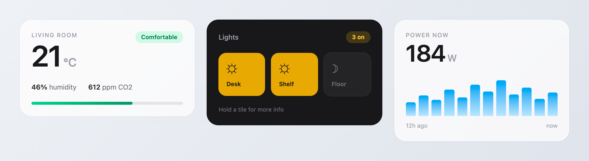

# Tailwind Template Card

A Home Assistant dashboard card that renders HTML styled with Tailwind CSS, with full access to your entities through Jinja templates.



```yaml
type: custom:tailwind-template-card
content: |
  <div class="rounded-3xl bg-white/60 p-5 ring-1 ring-black/5 backdrop-blur-xl">
    <div class="text-5xl font-semibold tracking-tight">
      {{ states('sensor.living_room_temperature') | round(0) }}<span class="text-2xl">°C</span>
    </div>
    <div class="text-sm text-zinc-500">Living room</div>
  </div>
```

## Credit where it's due

This is a fork of [**usernein/tailwindcss-template-card**](https://github.com/usernein/tailwindcss-template-card). The original design — rendering Jinja through Home Assistant's template engine, injecting Tailwind into a shadow root, the bindings and actions model — is [usernein](https://github.com/usernein)'s work, and this card would not exist without it. Upstream's last release was November 2023.

This fork modernises the internals and keeps it maintained. It also registers the original `custom:tailwindcss-template-card` type as an alias, so **configurations and community examples written for the original card work here unchanged**.

## Installation

### Via HACS (recommended)

1. Open **HACS** in Home Assistant.
2. Click the three-dot menu (top right) → **Custom repositories**.
3. Add `https://github.com/chukwudibarrah/tailwind-template-card` with category **Dashboard**.
4. Find **Tailwind Template Card** in the list and click **Download**.
5. Reload your browser when Home Assistant prompts you.

### Manually

1. Download `tailwind-template-card.js` from the [latest release](https://github.com/chukwudibarrah/tailwind-template-card/releases).
2. Copy it into your Home Assistant `config/www/` folder.
3. Go to **Settings → Dashboards → ⋮ → Resources → Add resource**:
   - URL: `/local/tailwind-template-card.js`
   - Type: **JavaScript module**
4. Reload your browser.

<details>
<summary>YAML-mode dashboards</summary>

```yaml
lovelace:
  resources:
    - url: /local/tailwind-template-card.js
      type: module
```
</details>

## Your first card

Add a card to any dashboard, choose **Manual**, and paste:

```yaml
type: custom:tailwind-template-card
ignore_line_breaks: true
content: |
  <div class="flex items-center gap-4 rounded-2xl bg-zinc-800 p-4 text-white">
    <div class="text-4xl font-bold">{{ states('sun.sun') }}</div>
    <div class="text-sm opacity-60">That's your sun entity</div>
  </div>
```

Swap `sun.sun` for any entity you own and you're away.

> **Tip:** keep `ignore_line_breaks: true` (the default). Without it every newline in your HTML becomes a `<br>`, which will wreck your layout.

## Reading entities and sensors

This is the part people usually get stuck on. There are three ways to get Home Assistant data into a card, and they compose freely.

### 1. Jinja templates — the main one

The `content` is rendered by Home Assistant's own template engine before it reaches the card. Anything that works in **Developer Tools → Template** works here: `states`, `state_attr`, `is_state`, `expand`, filters, loops, conditionals.

```yaml
type: custom:tailwind-template-card
ignore_line_breaks: true
content: |
  <div class="rounded-3xl bg-white/60 p-5 backdrop-blur-xl">

    <!-- a sensor value -->
    <div class="text-5xl font-semibold">
      {{ states('sensor.living_room_temperature') | round(1) }}°C
    </div>

    <!-- an attribute -->
    <div class="text-sm text-zinc-500">
      Humidity {{ state_attr('climate.living_room', 'current_humidity') }}%
    </div>

    <!-- a conditional -->
    <div class="text-sm {{ 'text-green-600' if is_state('binary_sensor.office_presence', 'on') else 'text-zinc-400' }}">
      {{ 'Someone is in' if is_state('binary_sensor.office_presence', 'on') else 'Empty' }}
    </div>

    <!-- a loop over several entities -->
    <div class="mt-3 flex gap-2">
      
        <div class="h-3 w-3 rounded-full {{ 'bg-amber-400' if is_state(light, 'on') else 'bg-zinc-300' }}"></div>
      
    </div>

    <!-- unavailable entities are worth handling explicitly -->
    <div class="text-xs text-zinc-400">
      
      {{ power ~ ' W' if power not in ['unknown', 'unavailable'] else 'No reading' }}
    </div>

  </div>
```

Home Assistant tells the card exactly which entities the template depends on, so it re-renders automatically when any of them change. There is nothing to configure.

### 2. Bindings — update without re-rendering

A binding evaluates a JavaScript expression and applies the result to elements matching a CSS selector. It updates in place rather than re-rendering the whole card, which is useful for values that change rapidly.

The expression is a **function body**, so it needs an explicit `return`.

In scope: `hass`, `config`, `entity`, `state`, `attr`. The last three refer to the card's configured `entity`. `this` is the matched element.

```yaml
type: custom:tailwind-template-card
entity: climate.living_room
content: |
  <div class="flex items-center gap-3">
    <span id="dot" class="h-2 w-2 rounded-full"></span>
    <span id="temp" class="text-4xl font-semibold"></span>
  </div>
bindings:
  - selector: "#temp"
    type: text
    bind: "return hass.states['sensor.living_room_temperature'].state"
  - selector: "#dot"
    type: class
    bind: "return state === 'heat' ? 'bg-orange-400' : 'bg-zinc-300'"
```

`type` may be `text`, `html`, `class`, `checked`, `value`, or any attribute name (`src`, `title`, `style`, …).

### 3. Actions — make it interactive

Actions run JavaScript when someone interacts with a matching element.

In scope: `hass`, `config`, `entity`, `moreInfo`, `event`. `this` is the element matching the selector.

```yaml
type: custom:tailwind-template-card
entity: light.living_room
content: |
  <div class="flex gap-2">
    <div id="power" class="cursor-pointer rounded-xl bg-zinc-200 px-4 py-2">Toggle</div>
    <div data-scene="scene.evening" class="cursor-pointer rounded-xl bg-zinc-200 px-4 py-2">Evening</div>
    <div id="details" class="cursor-pointer rounded-xl bg-zinc-200 px-4 py-2">Hold me</div>
  </div>
actions:
  - selector: "#power"
    type: click
    call: "entity.toggle()"

  - selector: "[data-scene]"
    type: click
    call: "hass.callService('scene', 'turn_on', { entity_id: this.dataset.scene })"

  - selector: "#details"
    type: hold
    call: "moreInfo('light.living_room')"
```

**Event types:** `click`, `dblclick`, `change`, `input`, `contextmenu`, and `hold` (a press of 500 ms or more — it suppresses the click that would otherwise follow).

**`entity` shorthand.** When the card has an `entity` configured, that entity's services are available as methods:

```yaml
call: "entity.toggle()"
call: "entity.turn_on({ brightness_pct: 40 })"
```

**`moreInfo(entityId?)`** opens Home Assistant's own entity dialog, exactly as built-in cards do. Called with no argument it uses the card's configured `entity`.

**Nested elements just work.** Selectors match with `closest()`, so an action bound to a tile still fires when someone taps an icon or label inside it.

### When the card doesn't update

For Jinja content, dependency tracking is automatic.

Entities referenced **only** inside `bindings` or `actions` are found by scanning those expressions. If you build an entity id dynamically, list it explicitly:

```yaml
entities:
  - sensor.built_at_runtime
```

`always_update: true` re-renders on every state change in your whole system. It works, but it's a blunt instrument — prefer `entities`.

## Configuration reference

| Option | Default | Description |
|---|---|---|
| `content` | `''` | The HTML (and Jinja) to render. |
| `entity` | `''` | Primary entity; populates `entity` / `state` / `attr` in bindings and actions. |
| `entities` | `[]` | Extra entities to watch for changes. |
| `parse_jinja` | `true` | Render `content` through Home Assistant's template engine. |
| `ignore_line_breaks` | `true` | When `false`, newlines become `<br>`. |
| `always_update` | `false` | Re-render on every state change. |
| `bindings` | `[]` | See [Bindings](#2-bindings--update-without-re-rendering). |
| `actions` | `[]` | See [Actions](#3-actions--make-it-interactive). |
| `plugins.daisyui.enabled` | `true` | Compile [daisyUI](https://daisyui.com) components into the card. |
| `plugins.daisyui.themes` | `light --default, dark --prefersdark` | daisyUI theme list. |
| `plugins.daisyui.theme` | `dark - dark` | Theme applied to this card. |
| `plugins.daisyui.overrideCardBackground` | `false` | Let daisyUI paint the card background. |

`plugins.daisyui.url` is accepted but ignored — daisyUI is compiled in rather than fetched from a CDN.

## The config editor

The visual editor uses Home Assistant's own `ha-code-editor`, so it inherits the
frontend's theme, keybindings and entity autocompletion — type `states('` and it
offers your entities.

That editor ships only `yaml` and `jinja2` CodeMirror languages, with no HTML
mode, so tag handling is added on top:

- Typing `>` after an opening tag closes it — `<div` becomes `<div></div>` with
  the caret in the middle. Void elements (`<br>`, ``, …), self-closing tags
  and a `>` inside an attribute value are left alone. If content follows the
  caret it moves to its own line at the current indent, rather than being left
  butted against the closing tag.
- Pressing Enter between `>` and `</` opens the element out over three lines and
  indents the caret.

Everything else — brackets, quotes, undo — is CodeMirror's own behaviour.

## Tailwind v4 notes

This card runs **real Tailwind CSS v4**, so v4 syntax works: `size-*`, `text-balance`, container queries (`@container`), and the v4 gradient utilities (`bg-linear-to-r`). Colours are emitted in `oklch`/`oklab`.

Classes are compiled from what the card is about to render, in two passes: the rendered HTML, then the live DOM once bindings have been applied.

Tailwind v4 implements gradients, transforms and shadows with registered custom
properties (`@property`). Browsers ignore `@property` when it arrives inside a
shadow root, so the card hoists those rules to the document — without that,
`bg-linear-*`, `scale-*` and `shadow-*` silently render as nothing.

Jinja is resolved by Home Assistant *before* the card sees the markup, so interpolated class names are already concrete and work fine:

```jinja

  <div class="h-12 w-12 rounded-lg bg-{{ colour }}-300"></div>

```

Classes introduced by bindings (`type: class`, or markup injected via `type: html`) are picked up by the second pass.

The one case not covered is a class applied by your own JavaScript at some arbitrary later point — an inline `onclick` that toggles a class the card has never rendered. Mention such classes somewhere in the content (a `hidden` element is enough) so they get compiled.

## What changed from the original

| | Upstream (v3.1.1) | This fork |
|---|---|---|
| CSS engine | [Twind](https://twind.style), a Tailwind v3 reimplementation, last published Jan 2023 | Real **Tailwind CSS v4**, compiled in the browser |
| daisyUI | 3.2 MB fetched from a public CDN on every dashboard load | **daisyUI 5** compiled in and tree-shaken |
| Template subscriptions | A new websocket subscription per state change, never closed | One per template, closed on teardown |
| Entity tracking | Scanned every entity in the state machine, string-matched the content | Uses the dependency list Home Assistant reports |
| Shadow DOM | Copied every `<style>` from the document head into each card | Nothing copied; the shadow root stays isolated |
| Config editor | Bundled Ace (~600 kB) | Home Assistant's own editor, with entity autocomplete and HTML tag closing |
| Interaction | `click`, `dblclick`, `change`, `input` | Adds `hold`, `contextmenu` and `moreInfo()` |
| Bundle | 976 kB (290 kB gzipped) | **790 kB (163 kB gzipped)** |
| Tests | none | 44 browser-driven assertions |

### Why the subscription fix matters

Upstream re-subscribed to `render_template` on every state update and never unsubscribed, so subscriptions accumulated for as long as a dashboard stayed open ([upstream #11](https://github.com/usernein/tailwindcss-template-card/issues/11)). This fork opens one subscription per template and closes it on teardown — covered by a test that drives 25 state updates and asserts a single surviving subscription.

## Contributing

Contributions are welcome — bug reports, examples, and pull requests alike.

**Reporting a bug.** Open an [issue](https://github.com/chukwudibarrah/tailwind-template-card/issues) with your card YAML (redact entity ids if you'd rather), your Home Assistant version, and anything the browser console printed. A screenshot helps for visual problems.

**Sharing a card.** If you build something good, open an issue or discussion with the YAML. Nice examples are welcome in the README.

**Working on the code:**

```bash
git clone https://github.com/chukwudibarrah/tailwind-template-card.git
cd tailwind-template-card
npm install

npm run dev     # Vite dev server
npm run lint    # ESLint
npm test        # builds, then runs the browser tests
npm run build   # production bundle into dist/
```

`npm test` drives a real browser through Playwright. It uses your installed Chrome if there is one, otherwise Playwright's bundled Chromium (`npx playwright install chromium`).

Before opening a pull request, please make sure `npm run lint` and `npm test` both pass, and add a test for any behaviour you change — the suite in [`test/run.mjs`](test/run.mjs) is plain JavaScript and easy to extend.

**Regenerating the README screenshot.** `npm run build && node scripts/screenshot.mjs`
renders demo cards with the real bundle and writes `images/cards.png`, so the
image always reflects what the card actually produces.

**Testing against a real Home Assistant.** Run `npm run build`, copy `dist/tailwind-template-card.js` into `config/www/`, and register it as a dashboard resource (see [Manually](#manually)). A hard refresh picks up rebuilds.

## Credits

- [**usernein**](https://github.com/usernein) for [tailwindcss-template-card](https://github.com/usernein/tailwindcss-template-card), which this is built on.
- [Tailwind CSS](https://tailwindcss.com) and [Home Assistant](https://home-assistant.io).
- [daisyUI](https://daisyui.com) for the optional component layer.
- Upstream's own acknowledgements: [threedy-card](https://github.com/dangreco/threedy), [Home-Assistant-Lovelace-HTML-Jinja2-Template-card](https://github.com/PiotrMachowski/Home-Assistant-Lovelace-HTML-Jinja2-Template-card), and [Twind](https://twind.style), which made the original possible.

## License

[MIT](LICENSE.txt), as the original.
